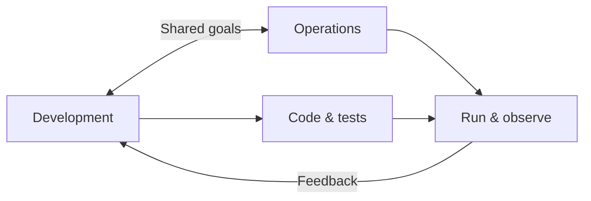

# Introduction to DevOps

## Goal

Understand what DevOps is, why teams adopt it, and how it differs from traditional silos.

## Concept

**DevOps** blends **development** (building software) and **operations** (running it reliably). Instead of handing code over a wall, teams share ownership from idea to production.

DevOps is not a single tool. It is **culture**, **practices**, and **tooling** that shorten feedback loops.

## Why does this exist?

**Problem:** Features ship late, production breaks, and developers and operators blame each other.

**Result:** Slow releases, firefighting, and unhappy users.

DevOps exists to **deliver value continuously** with **stability**.

## Mental model

## Real-world example

A team ships a web app. Developers push fixes daily. Operations used to manually copy files to servers. With DevOps practices, **automated pipelines** build, test, and deploy — and **monitoring** alerts the same team when errors spike.

## Try it

On paper or a notes file, sketch your last project:

1. Who wrote the code?
2. Who deployed it?
3. Who was paged when it failed?

Circle steps that were **manual** — those are DevOps improvement candidates.

## Hands-on lab

**Objective:** Map a simple application lifecycle.

1. List stages: plan → code → build → test → deploy → operate.
2. For each stage, write one **manual** step you have seen (e.g. “SSH and restart service”).
3. Mark which steps could be **automated** first.

**Expected result:** A one-page lifecycle with at least three automation ideas.

## Break it

Imagine deploy day: the release notes say “run script on server 3 only.” Server 3 was rebuilt last week and nobody updated the doc.

**What broke?** Knowledge lived in a person’s head, not in automation.

## Fix it

- Store deploy steps in a **script** or **pipeline**.
- Use the **same process** for every environment.
- Review runbooks when infrastructure changes.

## Common mistakes

- Calling DevOps “only CI/CD.”
- Buying tools without changing team habits.
- Letting developers ignore production metrics.
- Treating security as someone else’s job.

## Checkpoint

You can explain DevOps in one sentence and name two responsibilities of a DevOps-minded engineer.

## Next

Continue to **Lifecycle, CI/CD & Automation**.
