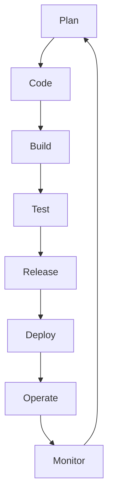

# Lifecycle, CI/CD & Automation

## Goal

Learn the DevOps lifecycle, CI vs CD, and where automation and monitoring fit.

## Concept

Software moves through a **loop**: plan, build, deliver, operate, learn. DevOps optimizes that loop.

- **CI (Continuous Integration):** Merge small changes often; automate build and test on each change.
- **CD (Continuous Delivery/Deployment):** Keep software releasable; deploy frequently with confidence.

**Automation** removes repetitive human steps. **Monitoring** tells you if changes helped or hurt.

## Why does this exist?

Manual releases are slow and error-prone. Without tests in the pipeline, bugs reach users. Without monitoring, failures stay invisible until customers complain.

## Mental model



## Real-world example

A developer pushes to `main`. CI runs unit tests and builds a package. CD deploys to staging automatically; production needs approval. After deploy, dashboards show error rate and latency.

## Try it

List three tasks you repeat when releasing software (or homework deployments). Example:

```bash
# Examples — adapt to your environment
git pull
npm test
systemctl restart myapp
```

## Hands-on commands

Simulate a minimal release checklist as shell commands:

```bash
cd ~/devops-lifecycle-lab 2>/dev/null || mkdir -p ~/devops-lifecycle-lab && cd ~/devops-lifecycle-lab
git init -q 2>/dev/null || true
echo "v1.0.0" > VERSION
git add VERSION 2>/dev/null && git commit -m "Bump version" 2>/dev/null || true
echo "Running smoke test..." && curl -sf -o /dev/null -w "HTTP %{http_code}\n" https://example.com || echo "Smoke test failed (expected if offline)"
echo "Deploy step would run here: rsync or kubectl apply"
```

## Hands-on lab

**Objective:** Identify automation wins.

1. Draw the lifecycle diagram on paper.
2. Pick **one** manual step from your list.
3. Write what would **verify** that step succeeded (test, health URL, log line).

**Challenge:** Define a “go/no-go” check before production (e.g. smoke test).

## Break it

A team automates deploy but **skips tests** to “move faster.” Incidents increase.

## Fix it

Add a minimal **quality gate**: tests must pass before deploy. Measure **deployment frequency** and **failure rate** together.

## Common mistakes

- Confusing “continuous deployment” with “no reviews.”
- Automating deploy without rollback plan.
- Ignoring logs and metrics after release.
- Running production changes only from one engineer’s laptop.

## Checkpoint

You can define CI and CD, and name two metrics (e.g. lead time, error rate) worth watching.

## Next

**Linux Fundamentals — Filesystem & Navigation**
