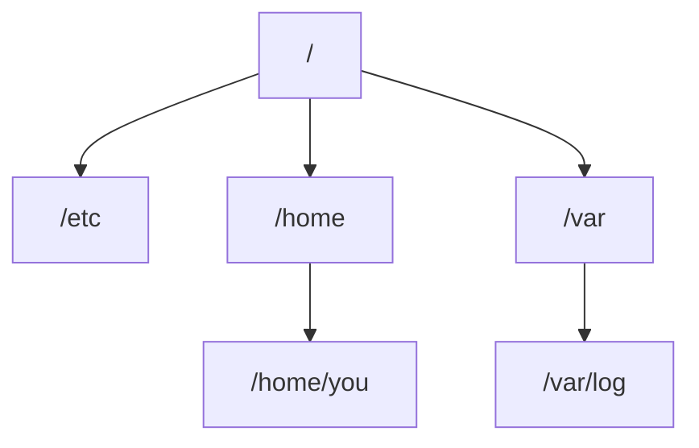

# Filesystem & Navigation

## Goal

Navigate the Linux filesystem and manage files and directories from the shell.

## Concept

Linux organizes everything in a **tree** starting at `/`. Your **home directory** (e.g. `/home/ubuntu`) holds personal files. Common paths: `/etc` (config), `/var/log` (logs), `/tmp` (temporary).

Paths `.` = current directory, `..` = parent.

## Why does this exist?

Servers rarely have a GUI. DevOps work — deploys, logs, configs — happens in the terminal.

## Mental model



## Real-world example

You SSH into a server and check application logs under `/var/log/nginx/` before restarting a service.

## Try it

```bash
pwd
ls -la
cd ~
mkdir devops-lab
cd devops-lab
touch app.log
mkdir logs
echo "DevOps learning" > logs/app.log
cat logs/app.log
```

## Hands-on lab

**Objective:** Create a small project layout.

1. Create `devops-lab` with subdirectories `app`, `logs`, and `config`.
2. Create `logs/app.log` with one line of text.
3. Use `find devops-lab` to list all files.

**Expected result:** Tree with three folders and at least one log file.

## Break it

Run `cat logs/app.log` from the wrong directory — “No such file or directory.”

## Fix it

Use `pwd` to see where you are. Use `cd` to the project root or pass the full path: `cat devops-lab/logs/app.log`.

## Common mistakes

- Spaces in filenames without quotes.
- Confusing `/` (root) with `/root` (root user home).
- Using `rm -rf` without checking path.
- Forgetting that Linux paths are case-sensitive.

## Checkpoint

You can use `pwd`, `ls`, `cd`, `mkdir`, `touch`, `cp`, `mv`, `cat`, `grep`, and `find` for basic tasks.

## Next

**Permissions, Users & sudo**
