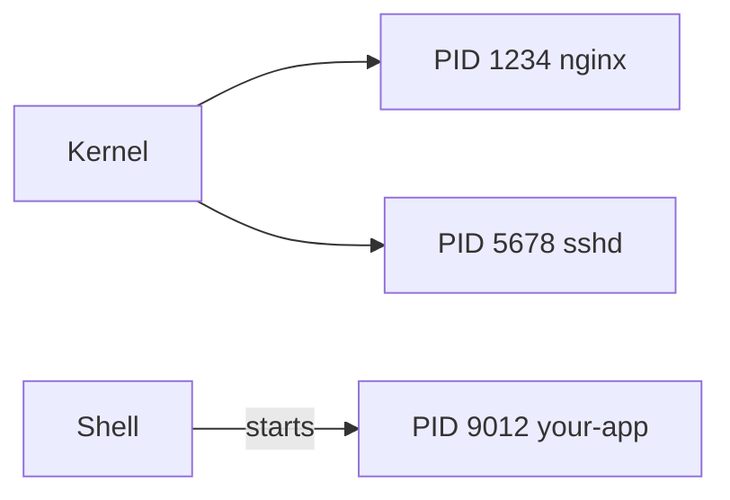

# Processes & Monitoring

## Goal

Understand processes, PIDs, and basic tools to inspect running programs.

## Concept

A **process** is a running program. Each has a **PID**. Processes can run in the **foreground** (your shell waits) or **background** (`&`).

`ps` lists processes; `top` / `htop` show live usage. `kill` sends signals (default: terminate).

## Why does this exist?

Production issues are often “service not running” or “runaway CPU.” You need to see what is running and stop or restart safely.

## Mental model



## Real-world example

After a deploy, the site is slow. You run `top`, see one worker at 99% CPU, note the PID, check logs, then restart the service.

## Try it

```bash
ps aux | head
sleep 30 &
jobs
ps aux | grep sleep
kill %1
```

## Hands-on commands

```bash
ps aux --sort=-%cpu | head -5
pgrep -a sleep 2>/dev/null || true
ping -c 20 127.0.0.1 >/dev/null &
PING_PID=$!
ps -p $PING_PID -o pid,cmd,%cpu,%mem
kill $PING_PID
wait $PING_PID 2>/dev/null
echo "Exit code: $?"
```

## Hands-on lab

**Objective:** Find a process and its PID.

1. Start `ping -c 100 127.0.0.1` in the background.
2. Use `ps aux | grep ping` to find the PID.
3. Stop it with `kill <PID>`.

**Challenge:** What is the difference between `kill` and `kill -9`?

## Break it

Kill the wrong PID — an unrelated program stops.

## Fix it

Double-check command name and user in `ps` output before `kill`. Prefer `systemctl stop unit` for managed services.

## Common mistakes

- Using `kill -9` as the first step.
- Ignoring zombie/defunct processes (often need parent fix).
- Not checking load before blaming “the network.”

## Checkpoint

You can find a process PID and explain foreground vs background execution.

## Next

**systemd & Logs**
