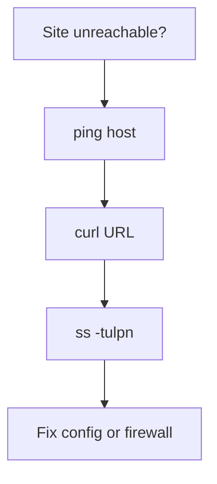

# curl, ping & ss

## Goal

Use common CLI tools to test connectivity and inspect listening ports.

## Concept

- **`ping`** — ICMP echo; checks reachability and latency.
- **`curl`** — HTTP/HTTPS client; great for APIs and headers.
- **`ss -tulpn`** — socket statistics; shows listeners and processes.

## Why does this exist?

When a site is down, you split the problem: DNS? Network? Service not listening? Wrong port?

## Mental model



## Real-world example

`curl -I https://example.com` returns `HTTP/2 200`. Locally, `ss -tulpn | grep 8080` confirms your app is bound.

## Try it

```bash
ping -c 3 google.com
curl -I https://example.com
ss -tulpn
```

## Hands-on lab

**Objective:** Verify a local or remote endpoint.

1. `curl -I` a public HTTPS site; note status code.
2. On your machine, list listeners and identify one port (SSH is common on 22).

**Challenge:** Use `curl -v` once and find where TLS handshake appears in output.

## Break it

`curl http://localhost:80` fails while the app listens on `8080`.

## Fix it

Change URL port or reconfigure the app/firewall to match expectations.

## Common mistakes

- Assuming `ping` failure means HTTP is down (ICMP may be blocked).
- Ignoring firewall rules on cloud security groups.
- Testing only from inside the server, not from a client.

## Checkpoint

You can run `ping`, `curl`, and `ss` to narrow down a connectivity issue.

## Next

**SSH Keys & Remote Access**
