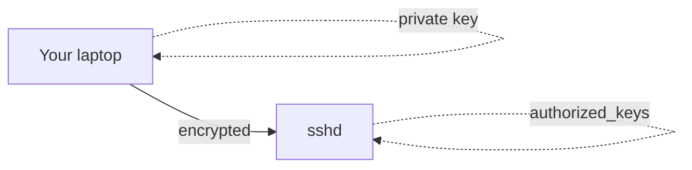

# SSH Keys & Remote Access

## Goal

Connect to remote Linux servers securely using SSH and key-based authentication.

## Concept

**SSH** encrypts a remote shell session. The **server** runs `sshd`; you use the **ssh client**.

**Key-based auth:** you generate a **private** key (secret) and **public** key (placed in `~/.ssh/authorized_keys` on the server).

## Why does this exist?

Passwords leak and are brute-forced. Keys scale automation (deploy scripts, CI) without embedding passwords.

## Mental model



## Real-world example

CI pipeline SSHs to a bastion host using a deploy key to run release commands — no interactive password.

## Try it

```bash
ssh-keygen -t ed25519 -C "devops-lab"
cat ~/.ssh/id_ed25519.pub
ssh user@server
```

(Use your VM user/host; add `-i` if the key path is non-default.)

## Hands-on lab

**Objective:** Prepare for passwordless login.

1. Generate a key pair if you do not have one.
2. Copy the **public** key to a test server’s `authorized_keys` (or use `ssh-copy-id`).
3. Connect with `ssh user@host` and confirm you are not prompted for a password (if configured).

**Challenge:** Add a `Host` entry in `~/.ssh/config` with `IdentityFile` and `User`.

## Break it

`Permission denied (publickey)` — wrong key, wrong user, or missing `authorized_keys` line.

## Fix it

- Check `~/.ssh` permissions (`700` dir, `600` private key).
- Verify public key on server matches your `.pub` file.
- Use `ssh -v` for debug output.

## Common mistakes

- Sharing private keys or committing them to Git.
- Using `chmod 777` on `.ssh`.
- Logging in as root when a deploy user exists.

## Checkpoint

You can generate keys, explain public vs private, and troubleshoot a failed key login.

## Next

**Git — Repositories, Commits & Branches**
