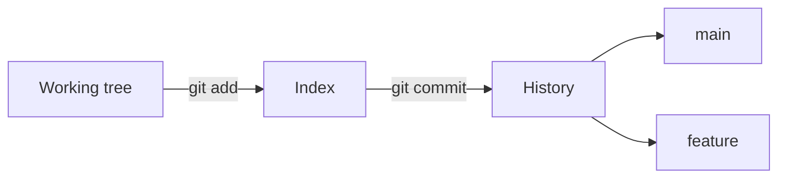

# Repositories, Commits & Branches

## Goal

Initialize a repo, commit changes, and work with branches.

## Concept

**Git** tracks snapshots (**commits**) in a **repository**. A **branch** is a movable pointer to a line of work — usually `main` is the default.

Workflow: edit files → **stage** (`git add`) → **commit** (`git commit`) → share later with remotes.

## Why does this exist?

Teams need history, collaboration, and rollback. DevOps pipelines trigger on Git events.

## Mental model



## Real-world example

A fix lives on `hotfix/login` until tests pass, then merges to `main` and triggers deployment.

## Try it

```bash
mkdir my-app && cd my-app
git init
echo "# My App" > README.md
git add .
git commit -m "Initial commit"
git branch
git log --oneline
```

## Hands-on lab

**Objective:** First repository.

1. Create a repo with README and one source file.
2. Make two commits with clear messages.
3. Create branch `feature/demo`, change a file, commit.

**Expected result:** `git log --oneline --graph --all` shows branches.

## Break it

Commit without `git add` — “nothing to commit.”

## Fix it

`git status` shows unstaged files. Stage then commit.

## Common mistakes

- Huge vague commit messages (“fix stuff”).
- Committing build artifacts or secrets.
- Long-lived branches without merging.

## Checkpoint

You can init a repo, commit, create a branch, and read `git log`.

## Next

**Remotes, Merge & .gitignore**
