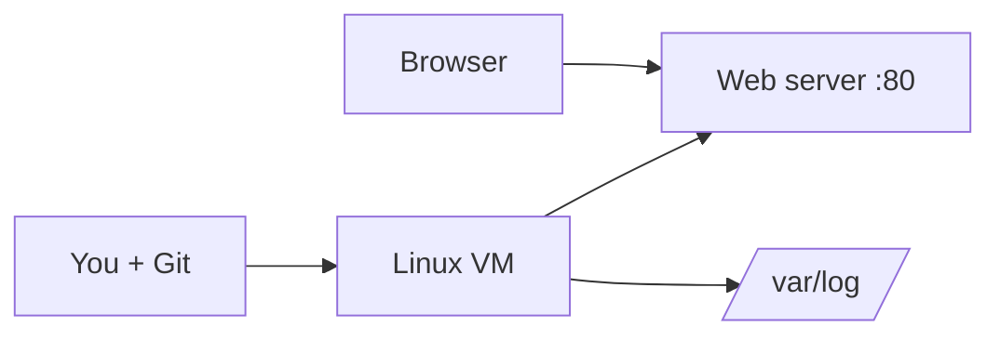

# Capstone — Simple Linux Web Server

## Goal

Combine Linux, networking, SSH, Git, scripting, and configuration into one beginner project.

## Concept

You will run a **web server** on a Linux VM, open **port 80**, verify access remotely, read **logs**, version work in **Git**, and automate deploy steps with a **script**.

## Why does this exist?

This mirrors a minimal real-world path: provision → configure → expose → observe → automate.

## Mental model



## Real-world example

A static site or default welcome page proves DNS/firewall/service chain works before you add containers and CI.

## Try it

On Ubuntu/Debian-style systems:

```bash
sudo apt update
sudo apt install -y nginx
sudo systemctl enable --now nginx
curl -I http://localhost
```

## Hands-on commands

```bash
# On your Linux VM after SSH login:
sudo apt update && sudo apt install -y nginx git
echo "<h1>DevOps Lab</h1>" | sudo tee /var/www/html/index.html
sudo systemctl enable --now nginx
sudo ufw allow 80/tcp 2>/dev/null || true
curl -I http://127.0.0.1
sudo tail -n 5 /var/log/nginx/access.log

mkdir -p ~/site && cd ~/site && git init -b main
cp /var/www/html/index.html ./index.html 2>/dev/null || echo "<h1>DevOps Lab</h1>" > index.html
git add index.html && git commit -m "Initial site"

cat > deploy.sh << 'EOF'
#!/bin/bash
set -euo pipefail
sudo cp -r . /var/www/html/
sudo systemctl reload nginx
echo "Deploy OK"
EOF
chmod +x deploy.sh
```

## Hands-on lab

**Objective:** End-to-end beginner server.

### Environment

- Linux VM (cloud or local)
- SSH access
- sudo rights

### Steps

1. **VM:** Create or use a Linux instance; SSH in with keys.
2. **Web server:** Install Nginx (or Apache); place a simple `index.html` in the site root.
3. **Firewall:** Allow HTTP (port 80) — cloud security group + `ufw` if enabled.
4. **Remote test:** From your laptop, open `http://<server-ip>` or use `curl`.
5. **Logs:** Inspect access/error logs; generate a 404 and find it in logs.
6. **Git:** Initialize a repo for `index.html`, config snippets, and scripts.
7. **Deploy script:** Write `deploy.sh` that copies site files and reloads the web server.

### Expected result

- Site loads from another machine.
- `systemctl status` shows active web server.
- Git history shows at least two commits.
- `./deploy.sh` updates content without manual copy/paste.

### Challenge

Add a `APP_ENV` variable in your script to deploy to different target directories for `staging` vs `production` on the same VM.

## Break it

Site works on the server (`curl localhost`) but not from your laptop.

## Fix it

Check cloud security group, local firewall (`ufw status`), and that Nginx listens on `0.0.0.0:80` (`ss -tulpn`).

## Common mistakes

- Testing only from inside the VM.
- Forgetting to reload Nginx after file changes.
- Running deploy scripts as root without need.

## Checkpoint

You can stand up a basic web server, verify it remotely, read logs, track config in Git, and run a deploy script.

## Next

Congratulations — you completed the **Beginner** track. Intermediate topics (Docker, CI/CD, Terraform, and more) will extend this foundation.
