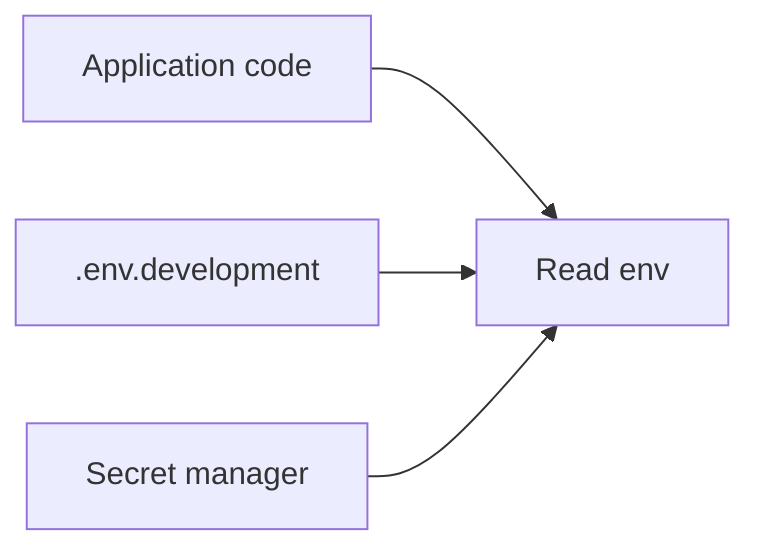

# Config, Secrets & .env

## Goal

Configure applications with environment variables and handle secrets safely.

## Concept

**Environment variables** are key/value pairs inherited by processes. Apps read them for ports, database URLs, and feature flags.

A **`.env` file** loads local config; it must stay **out of Git**. **Secrets** belong in vaults or platform secret stores in production.

## Why does this exist?

Same artifact should run in dev, staging, and prod with **different config** — not different code.

## Mental model



## Real-world example

`DATABASE_URL` points to a local Postgres in dev and a managed instance in production.

## Try it

```bash
export APP_ENV=development
echo $APP_ENV
APP_PORT=8080 node -e 'console.log(process.env.APP_PORT)'
```

## Hands-on lab

**Objective:** Two configurations.

1. Create `config/app.env.example` with keys `APP_ENV` and `APP_PORT` (no real secrets).
2. Copy to `config/app.env` locally and set dev values.
3. Add `config/app.env` to `.gitignore`.

**Challenge:** Run a one-liner that prints different messages when `APP_ENV=production` vs `development`.

## Break it

Commit `app.env` with a real API key to a public repo.

## Fix it

Rotate the secret, remove from history if possible, use ignores and pre-commit checks going forward.

## Common mistakes

- Logging environment variables in production.
- Using `export` in scripts without documenting required vars.
- Treating example files as optional when onboarding new devs.

## Checkpoint

You can export vars, explain why `.env` is gitignored, and separate config per environment.

## Next

**Capstone: Simple Linux Web Server**
