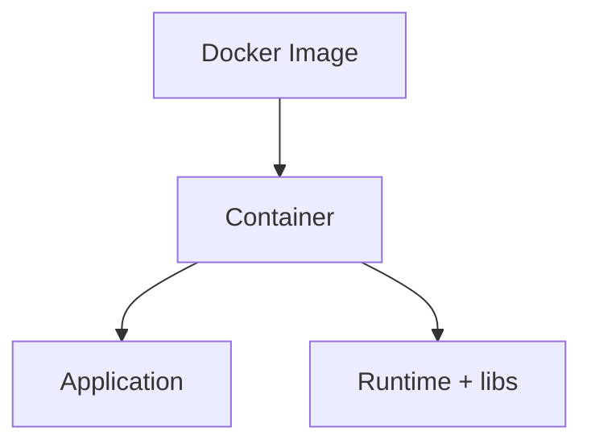

# Containers & Images

## Goal

Understand why containers exist and run your first Docker commands.

## Concept

**Problem:** “It works on my machine” — different OS packages and versions break deployments.

**Containers** package the app with dependencies and share the **host kernel**, unlike full VMs.

- **Image:** read-only template (layers)
- **Container:** running instance of an image
- **Registry:** stores and distributes images (Docker Hub, ECR, GCR)

## Mental model



## Try it

```bash
docker run hello-world
docker ps
docker ps -a
docker images
```

## Hands-on lab

1. Pull and run `nginx` detached on port 8080.
2. `curl -I http://localhost:8080`
3. List the container ID and stop it.

## Break it

Browser cannot reach the app — wrong host port mapping.

## Fix it

`docker ps` and verify `0.0.0.0:8080->80/tcp`. Adjust `-p host:container`.

## Checkpoint

Explain image vs container and read `docker ps` output.

## Next

**Writing a Dockerfile**
